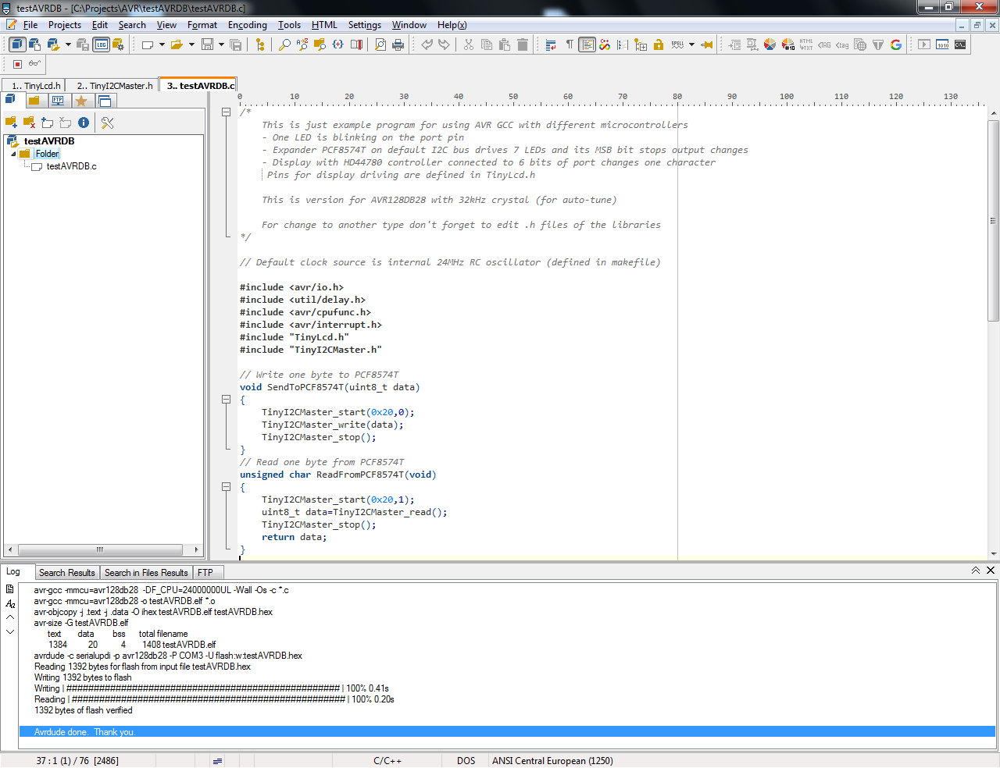
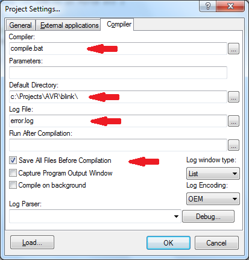

How to develop for AVR microcontrollers in Windows
==================================================

Microcontrollers based on the AVR core from the former Atmel company (now part of Microchip) are popular among professional and hobbyist electrical engineers due to their price and features. There are several different environments for developing programs, which are often bulky and sometimes generate larger code. If you prefer smaller program packages or struggle with the size of the compiled code, you can go directly to the AVR-GCC tool itself, which is the basis of a number of available IDEs..

The following procedure shows how this tool can be used to create an environment for writing, compiling, and programming simple programs into these microcontrollers.

Simple development environment for AVR microcontrollers
-------------------------------------------------------

*   Get toolchain (compiler) for AVR processors
*   Set PATH variable to bin folders in Windows environment
*   PsPad tool
*   Set PsPad environment

Compiler for AVR processors including avrdude programmer
--------------------------------------------------------

First you will need a tool for compiling programs for AVR processors. A proven and reliable one is the AVR-GCC compiler, which can be found in several places. From my own experience I can recommend the package from ZakKemble, which can be found here [version 15.2.0](https://github.com/ZakKemble/avr-gcc-build/releases/tag/v15.2.0-1). It is about 150 MB in size and when installing, place it in the C:\AVR_GCC folder, for example.

Setting the PATH system variable
---------------------------------

In Windows, you need to set (add) a new PATH variable using the link in "Settings" -> "System" -> "Advanced system settings" that will point to the "bin" folder of the installed compiler package. For example:
C:\AVR_GCC\bin and C:\AVR_GCC\avr\bin


Editor PSPad
------------
If you don't have your own favorite and used environment for writing programs, you can try PSPad. [PSPad editor](https://www.pspad.com/en/) is a freeware programmer's editor for MS Windows. Download and install it from the link provided (approx. 14 MB).



PSPad settings
--------------

Determine a working folder for your project. For example, in the folder C:\Projects\AVR\ we will create a folder "blink". In it, we will create at least the following files using PSPad (or copy the source files from the "src" folder available above):

1) compile.bat - will contain text:

```
REM Compile
make > error.log 2>&1
```

2) Makefile - will contain text (on the top lines we will enter the project name, microcontroller and programmer parameters):

```
# The MCU model
MCU=atmega168
# Name of main PROJ.c file and name for temporary output files
PROJ=blink
# CPU clock frequency
CLOCK=8000000UL
# Type of programmer
PROGRAMMER=stk500v2
# COM port for programmer
PORT=COM4

default:
# Compile C source and library files - every *.c to *.o
	avr-gcc -mmcu=$(MCU)  -DF_CPU=$(CLOCK) -Wall -Os -c *.c
# Link compiled files to -elf
	avr-gcc -mmcu=$(MCU) -o $(PROJ).elf *.o

# Create HEX file
	avr-objcopy -j .text -j .data -O ihex $(PROJ).elf $(PROJ).hex
# Show memory usage
	avr-size -G $(PROJ).elf
# Upload file to microcontroller (parameter -B 125kHz is suitable for longer cable)
	avrdude -c $(PROGRAMMER) -p $(MCU) -P $(PORT) -B 125kHz -U flash:w:$(PROJ).hex
# Here you can clean up temporary files (if you prefer)
#	del /f *.hex *.elf *.o
```

3) The source file test.c - will contain, for example, the blinking of the LED on PB1:

```
#include <avr/io.h>
#include <util/delay.h>

int main()
{
    DDRB |= 0x2;  // LED is on PortB bit 1
    while (1)
    {
        PORTB ^= 0x2;        // Blink LED
        _delay_ms(800);
    }
    return 0;
}
```
 
We will create a project in PSPad, where we will insert the blink.c file as part of the project (in the folder on the left) and in the "Projects" -> "Project Settings" -> "Compiler" settings we will adjust the compiler settings as shown in the image:



Starting the compiler using the icon or the keyboard shortcut Ctrl+F9 should ensure that the program compiles without errors, with the amount of memory used listed in the bottom PSPad window. 

Other files
-----------

The makefile contains a command to program only the microcontroller's program memory. To set the fuses for the microcontroller, use the prepared "setfuse.bat" file, in which you change the fuse values ​​according to the data from one of the web calculators. The command in this file calls the "avrdude" program and passes it the values ​​for each fuse. This usually only needs to be done once before you start writing the program.

The source directory always includes a .ppr file with the project settings for PsPad. The directories also include the libraries used for the sample examples. This shows one of the options for storing libraries. Keeping the library in the same folder as the source file ensures that when someone "improves" the library in the future, the compiler will not start reporting a series of unexpected errors.

Good luck working with AVR processors!
* * *

Jak vyvíjet programy pro AVR mikrořadiče ve Windows
===================================================

Mikrořadiče založené na jádře AVR od bývalé firmy Atmel (nyní součást Microchip) jsou díky své ceně a svým vlastnostem populární mezi profesionálními i hobby elektrotechniky. Pro vývoj programů existuje více různých prostředí, které jsou často objemné a někdy generují rozsáhlejší kód. Pokud preferujete menší programové balíky nebo bojujete s velikostí přeloženého kódu, můžete sáhnout přímo po samotném nástroji AVR-GCC, který je základem řady dostupných IDE.

Následující postup ukazuje, jak lze tento nástroj použít a vytvořit si prostředí pro psaní, překlad a naprogramování jednoduchých programů do těchto mikrořadičů.

Postup pro přípravu jednoduchého vývojového prostředí pro AVR procesory
-----------------------------------------------------------------------

*   Stáhnout a nainstalovat nástrojový řetězec (překladač) pro AVR procesory
*   Nastavit proměnnou PATH na složky bin v prostředí Windows
*   Stáhnout a nainstalovat PSPad
*   Nastavit PsPad prostředí projektu

Překladač pro AVR procesory včetně programátoru avrdude
-------------------------------------------------------

Jako první budete potřebovat nástroj pro překlad programů pro AVR procesory. Mezi ověřené a spolehlivé se řadí AVR-GCC překladač, který jde nalézt na více místech. Z vlastní zkušenosti mohu doporučit balík od ZakKemble, který najdete např. zde [verze 15.2.0](https://github.com/ZakKemble/avr-gcc-build/releases/tag/v15.2.0-1). Je velký asi 150 MB a při instalaci jej rozbalte např. do složky C:\AVR_GCC.

Nastavení systémové proměnné PATH
---------------------------------

Ve Windows je potřeba nastavit (přidat) pomocí odkazu v "Nastavení" -> "Systém" -> "Upřesnit nastavení systému" nová data do proměnné PATH, která budou ukazovat na složky bin instalovaného balíku s překladačem. Např.
C:\AVR_GCC\bin a C:\AVR_GCC\avr\bin


Editor PSPad
------------

Nemáte-li své vlastní oblíbené a používané prostředí pro psaní programu, můžete vyzkoušet PSPad. [PSPad editor](https://www.pspad.com/en/) je volně šiřitelný (freeware) univerzální editor pro MS Windows. Stáhněte a nainstalujte si jej z uvedeného odkazu (cca 14 MB).


Nastavení PSPad
---------------

Určete si pracovní složku pro svůj projekt. Např. ve složce C:\Projects\AVR\ vytvoříme složku "blink". Do ní vytvoříme pomocí PSPad (nebo zkopírujeme ze zdrojových souborů z výše dostupné složky "src") alespoň tyto soubory:

1) compile.bat - bude obsahovat text:

```
REM Compile
make > error.log 2>&1
```

2) Makefile - bude obsahovat text (na horních řádcích uvedeme jméno projektu, parametry mikrořadiče a programátoru):

```
# The MCU model
MCU=atmega168
# Name of main PROJ.c file and name for temporary output files
PROJ=blink
# CPU clock frequency
CLOCK=8000000UL
# Type of programmer
PROGRAMMER=stk500v2
# COM port for programmer
PORT=COM4

default:
# Compile C source and library files - every *.c to *.o
	avr-gcc -mmcu=$(MCU)  -DF_CPU=$(CLOCK) -Wall -Os -c *.c
# Link compiled files to -elf
	avr-gcc -mmcu=$(MCU) -o $(PROJ).elf *.o

# Create HEX file
	avr-objcopy -j .text -j .data -O ihex $(PROJ).elf $(PROJ).hex
# Show memory usage
	avr-size -G $(PROJ).elf
# Upload file to microcontroller (parameter -B 125kHz is suitable for longer cable)
	avrdude -c $(PROGRAMMER) -p $(MCU) -P $(PORT) -B 125kHz -U flash:w:$(PROJ).hex
# Here you can clean up temporary files (if you prefer)
#	del /f *.hex *.elf *.o
```

3) Vlastní zdrojový soubor test.c - bude obsahovat např. blikání LED na PB1:

```
#include <avr/io.h>
#include <util/delay.h>

int main()
{
    DDRB |= 0x2;  // LED is on PortB bit 1
    while (1)
    {
        PORTB ^= 0x2;        // Blink LED
        _delay_ms(800);
    }
    return 0;
}
```
 
Vytvoříme si v PSPad projekt, u kterého vložíme soubor blink.c jako součást projektu (do složky vlevo) a v nastavení "Projects" -> "Project Settings" -> "Compiler" upravíme nastavení kompilátoru podle obrázku:


Spuštění kompilátoru pomocí ikony nebo klávesové zkratky Ctrl+F9 by mělo zajistit přeložení programu bez chyb s vypsáním velikosti obsazené paměti ve spodním okně PSPad. 

Další soubory
-------------

Soubor makefile obsahuje příkaz pro naprogramování pouze programové paměti mikrořadiče. Pro nastavení pojistek u mikrořadiče použijte připravený soubor "setfuse.bat", ve kterém změníte hodnoty pojistek podle údajů některé z webových kalkulaček. Příkaz v tomto souboru volá program "avrdude" a předá mu hodnoty pro jednotlivé pojistky. To obvykle stačí udělat jednou před zahájením psaní programu.

Ve zdrojovém adresáři je přiložen vždy i soubor .ppr s nastavením projektu pro PsPad. V adresářích jsou přiloženy i použité knihovny pro ukázkové příklady. Ukazuje to jednu z možností ukládání knihoven. Ponechání knihovny ve složce současně se zdrojovým souborem zajistí, že až v budoucnu někdo "vylepší" knihovnu, nezačne překladač hlásit řadu nečekaných chyb. 

Hodně úspěchů při práci s AVR procesory!

